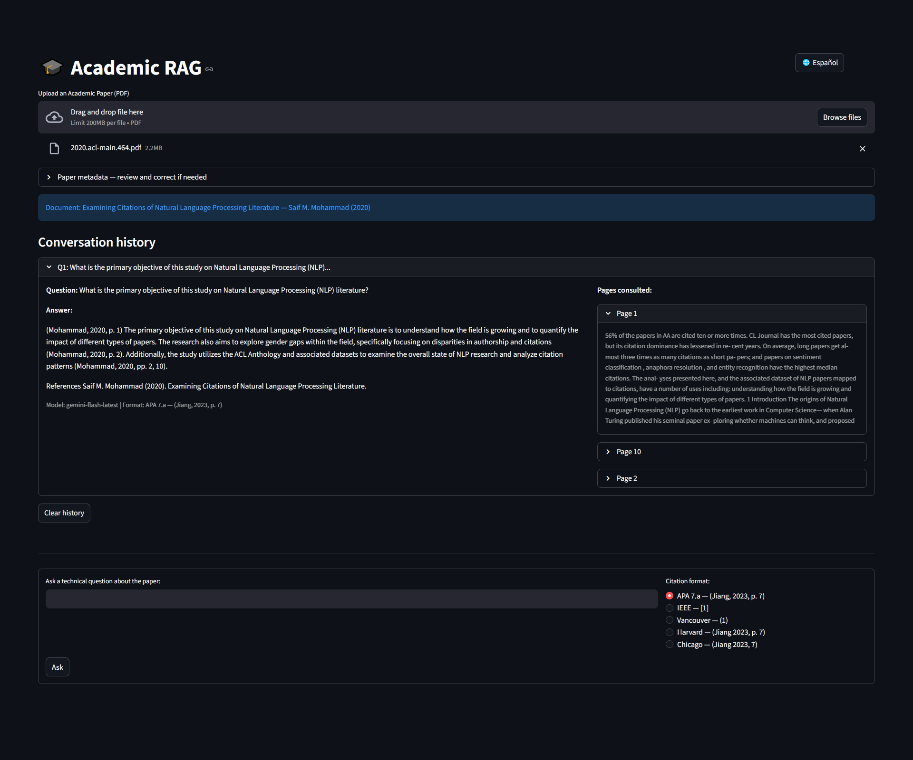

# 🎓 Academic RAG Assistant

> **Upload an academic paper. Ask technical questions. Get cited answers in APA, IEEE, Vancouver, Harvard or Chicago — automatically.**

---

## The Problem

Reading academic papers is slow. Finding a specific claim, methodology or result means scanning dozens of pages. And when you finally find it, you still have to format the citation manually.

**Academic RAG solves this**: upload a PDF, ask a question in plain language, and get a grounded answer with properly formatted citations pointing to the exact pages.

---

## Demo



---

## Features

- **RAG pipeline** — answers are grounded exclusively in the uploaded document, never hallucinated
- **5 citation formats** — APA 7th, IEEE, Vancouver, Harvard, Chicago 17th
- **Per-format citation rules** — each format has its own prompt with the exact conventions (e.g. APA uses "p." and comma before year; Chicago omits "p."; Vancouver never includes page numbers inline)
- **Automatic metadata extraction** — title, author and year extracted from PDF; editable before querying
- **Bilingual** — English / Spanish, switchable mid-session
- **Local embeddings** — `all-MiniLM-L6-v2` via HuggingFace, no external embedding API needed
- **Model fallback** — tries `gemini-2.0-flash` → `gemini-flash-latest` → `gemini-pro-latest` automatically

---

## Quick Start

```bash
pip install -r requirements.txt
```

Create a `.env` file:
```
GOOGLE_API_KEY=your_key_here
```

Run:
```bash
streamlit run app.py
```

---

## How It Works

```
PDF upload
    ↓
Extract text per page  →  chunk (800 tokens, 100 overlap)
    ↓
FAISS vector index  (local, HuggingFace embeddings)
    ↓
User question  →  similarity search  →  top-3 chunks
    ↓
Prompt = system + citation format rules + context + question
    ↓
Gemini  →  grounded answer with inline citations + reference list
```

---

## Citation Format Detail

Each format is implemented with its specific rules, not just a label:

| Format | In-text style | Page indicator | Year position |
|--------|--------------|----------------|---------------|
| APA 7th | (Smith, 2023, p. 7) | `p.` / `pp.` | After comma |
| IEEE | [1, p. 7] | `p.` in text | In reference |
| Vancouver | (1) | None in text | In reference |
| Harvard | (Smith 2023, p. 7) | `p.` / `pp.` | No comma |
| Chicago 17th | (Smith 2023, 7) | Number only | No comma |

---

## Stack

Python 3.11 · Streamlit · LangChain · FAISS · HuggingFace Transformers · Google Gemini · PyPDF2

---

## Roadmap

- [ ] Multi-document support (compare two papers)
- [ ] Export full bibliography as `.bib` file
- [ ] Highlight source pages in PDF viewer
- [ ] Support for MLA format

---

## License

MIT
